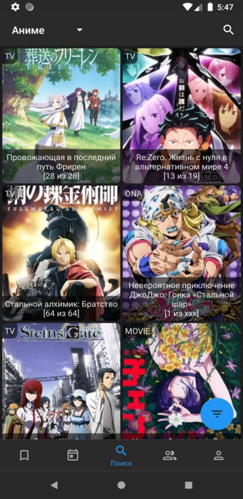
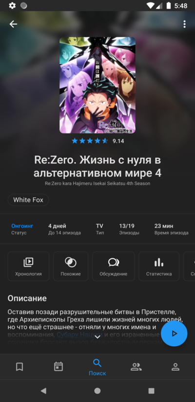
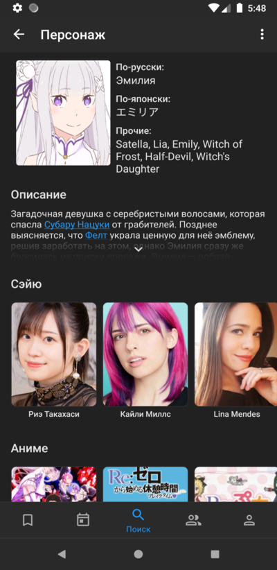
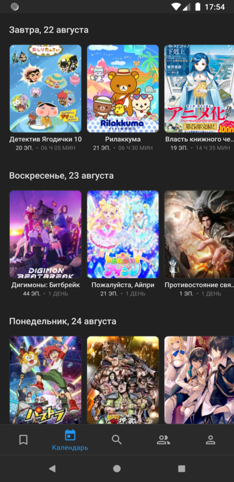
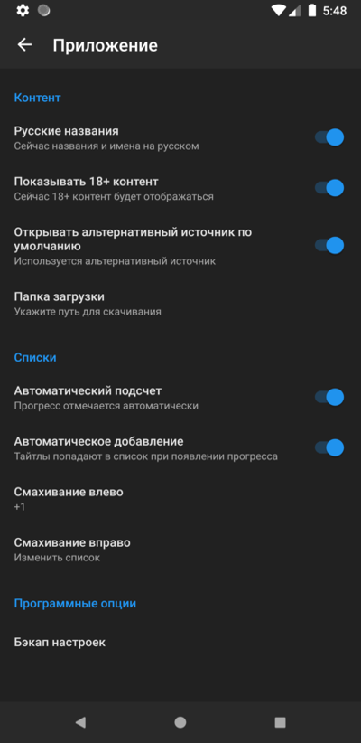

<p align="center">
  
</p>

<h1 align="center">Shikimori App Remastered</h1>

<p align="center">
  <a href="https://github.com/kotoshii/Shikimori-App-Remastered/releases/latest"></a>
  <a href="https://github.com/kotoshii/Shikimori-App-Remastered/releases"></a>
  <a href="LICENSE"></a>
</p>

<p align="center">
  <a href="README.md">Русский</a> · <b>English</b>
</p>

Android client for [shikimori.io](https://shikimori.io). Anime and manga database, your lists, forum, and watching episodes in the app.

This is a fork of [gnoemes/Shikimori-App-Remastered](https://github.com/gnoemes/Shikimori-App-Remastered). The original is still around, but it gets updated mostly when Shikimori breaks something, and builds go to the author's Telegram instead of GitHub. This fork is kept working, and APKs are published here.

## Contents

- [Contents](#contents)
- [Install](#install)
- [Screenshots](#screenshots)
- [What's different from the original](#whats-different-from-the-original)
  - [Major features](#major-features)
  - [Smaller things](#smaller-things)
  - [Fixed along the way](#fixed-along-the-way)
- [Building](#building)
- [Credits](#credits)

## Install

[Download the latest APK](https://github.com/kotoshii/Shikimori-App-Remastered/releases/latest)

Needs Android 4.1 or newer. Allow installs from unknown sources, and when you open the app Play Protect will probably ask to scan or verify it. That happens with any APK installed outside the store.

Versions are `major.minor.patch`, like `0.8.8`. Older releases had a fourth build number in the end, like `0.8.7.1`. It is not used anymore.

## Screenshots

<p align="center">
  
  
  
  
  
</p>

## What's different from the original

Both apps allow watching anime online.

### Major features

#### 🖼 Posters are back

Shikimori stopped sending covers in the JSON API for anything added recently and hands back a grey placeholder instead. The app asks their GraphQL API for the real image, so covers are where they belong again — catalog, calendar, search, anime and manga pages, chronology, your lists and the forum.

#### 🎬 Eleven video hosts, and nothing in between

Kodik, VK, OK, mail.ru, Sibnet, SovetRomantica, AnimeJoy, AllVideo, Dzen, cda.pl and matreshka.tv. The app talks to every one of them straight from your phone, with no server of ours in the middle — less to wait for, and nothing outside the app that can quietly stop working. When a host redesigns its player, the fix comes with the next app update. Anime 365 works too, with a subscription on their side.

#### 🧹 An episode list with only the hosts you want

A host may be dead, blocked where you live, or simply slow for you. Hide any of them in settings and the episode list stops offering them. Nothing is hardcoded: the filter works on whatever actually turns up in your list.

#### 📥 Downloads the app handles itself

You get a real, playable video file at the end — the app does the downloading rather than handing the link to Android's download manager. Progress and a cancel button sit in the notification, and tapping it once it is done opens the file.

#### 🎯 Choose the host before the qualities load

When the same translation sits on several hosts, the app asks which one you want first and then loads qualities for that one alone. No waiting on hosts you were never going to pick.

#### 🔄 It tells you when there is a new version

The app checks this repo for a newer release when it starts. Nothing installs on its own: you get the changelog and a button, and the APK is downloaded inside the app rather than in a browser.

### Smaller things

- The secondary source can open by default instead of the main one.
- Long press a host to copy the episode link.
- Far fewer "Too Many Requests" errors. Shikimori limits both how fast and how many requests you send, so everything now goes through one queue that spaces them out. It used to bite hardest when opening an anime page and its chronology right after.

### Fixed along the way

- One broken host used to take the whole app down with it, or leave the download list empty. Now it steps aside and the rest still work.
- ok.ru stopped playing when the site changed its player. Quality selection is back, 144 through 1080.
- Sharing an episode from Kodik handed out a link that could not be opened.
- A failed request could leave a screen empty until you went back.
- Light novels were shown as manga on some screens, and some anime kinds were missing entirely.
- Chronology skipped entries, and could hang on titles with an empty franchise.
- Switching episodes could pick the wrong author.
- Downloading an Anime 365 episode could crash.
- Other minor bug fixes.

## Building

Old project with an old toolchain. StorIO is used with deprecated modules and code generation, which is what keeps everything pinned to 2018 versions. Moving to Room would fix that.

- JDK 8. Gradle 4.10.1 and AGP 3.2.1 do not run on newer ones.
- [Android Studio 4.1.1](https://developer.android.com/studio/archive) or older.
- Android SDK 28.

```
./gradlew assembleDebug
```

There is no signing config in the repo, so release builds come out unsigned.

## Credits

Original app by [gnoemes](https://github.com/gnoemes). GPL-3.0, same as the original, see [LICENSE](LICENSE).
