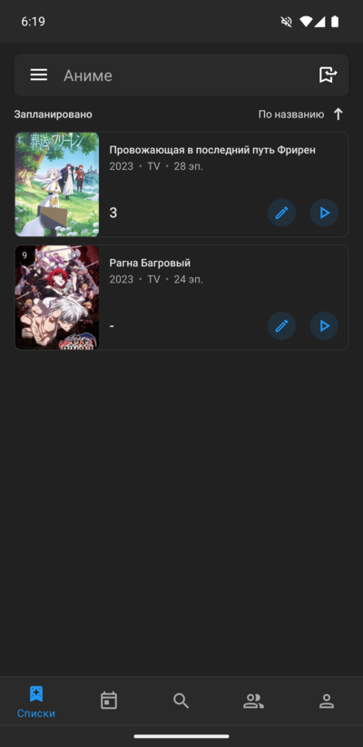
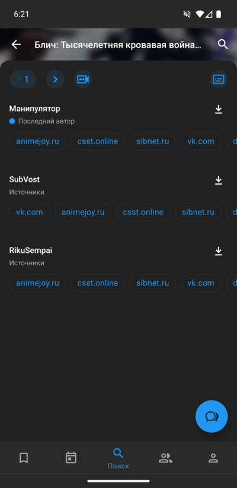
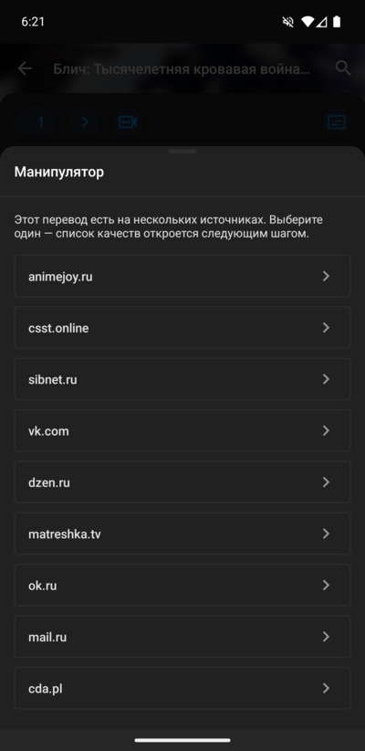
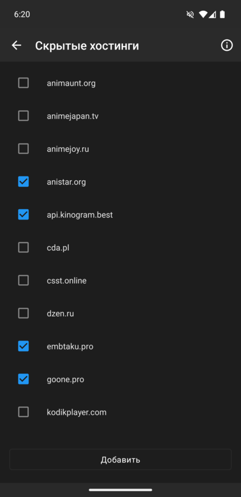
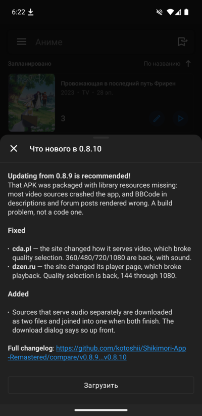

<p align="center">
  
</p>

<h1 align="center">Shikimori App Remastered</h1>

<p align="center">
  <a href="https://github.com/kotoshii/Shikimori-App-Remastered/releases/latest"></a>
  <a href="https://github.com/kotoshii/Shikimori-App-Remastered/releases"></a>
  <a href="LICENSE"></a>
</p>

<p align="center">
  <b>Русский</b> · <a href="README.en.md">English</a>
</p>

Android-клиент для [shikimori.io](https://shikimori.io). База аниме и манги, ваши списки, форум и просмотр эпизодов прямо в приложении.

Это форк [gnoemes/Shikimori-App-Remastered](https://github.com/gnoemes/Shikimori-App-Remastered). Оригинал никуда не делся, но обновляется в основном тогда, когда что-то ломается на Шикимори, а сборки выкладываются в телеграм автора, а не на GitHub. Этот форк поддерживается в рабочем состоянии, APK публикуются здесь.

## Содержание

- [Содержание](#содержание)
- [Установка](#установка)
- [Скриншоты](#скриншоты)
- [Чем отличается от оригинала](#чем-отличается-от-оригинала)
  - [Основные возможности](#основные-возможности)
  - [Небольшие изменения](#небольшие-изменения)
  - [Исправления](#исправления)
- [Сборка](#сборка)
- [Благодарности](#благодарности)

## Установка

[Скачать последний APK](https://github.com/kotoshii/Shikimori-App-Remastered/releases/latest)

Нужен Android 4.1 или новее. Разрешите установку из неизвестных источников. При первом запуске Play Protect, скорее всего, предложит проверить приложение — так бывает с любым APK, установленным не из магазина.

Версии выглядят как `major.minor.patch`, например `0.8.8`. В старых релизах в конце был четвёртый номер сборки, например `0.8.7.1`. Сейчас он не используется.

## Скриншоты

<p align="center">
  
  
  
  
  
  
  
  
  
  
</p>

## Чем отличается от оригинала

Оба приложения позволяют смотреть аниме онлайн.

### Основные возможности

#### 🖼 Постеры вернулись

Шикимори перестал отдавать обложки в JSON API для всего, что добавлено недавно, и возвращает серую заглушку. Приложение запрашивает настоящую картинку через их GraphQL API, поэтому обложки снова на своих местах — в каталоге, календаре, поиске, на страницах аниме и манги, в хронологии, ваших списках и на форуме.

#### 🎬 Одиннадцать видеохостингов — и ничего лишнего

**Kodik, VK, OK, mail.ru, Sibnet, SovetRomantica, AnimeJoy, AllVideo, Dzen, cda.pl и matreshka.tv.** \
Приложение напрямую подключается к каждому из них с вашего телефона — без промежуточного сервера с нашей стороны. Меньше ожидания и меньше вещей за пределами приложения, которые могут внезапно перестать работать. Если хост изменит свой плеер, исправление появится в следующем обновлении приложения. Anime 365 тоже поддерживается, но для него нужна подписка с их стороны.

#### 🧹 В списке эпизодов только нужные хостинги

Хост может быть недоступен, заблокирован в вашем регионе или просто медленно работать именно у вас. Спрячьте любой из них в настройках, и он больше не будет отображаться в списке эпизодов. Никаких жёстко заданных значений — фильтр работает с теми хостами, которые реально появляются в вашем списке.

#### 📥 Приложение само управляет загрузками

В итоге вы получаете настоящий видеофайл, который можно воспроизвести — приложение само скачивает его, а не передаёт ссылку системному менеджеру загрузок Android. Прогресс загрузки и кнопка отмены отображаются в уведомлении, а после завершения нажатие на него открывает файл.

#### 🎯 Сначала хостинг, потом качества

Если один и тот же перевод доступен на нескольких хостингах, приложение сначала предлагает выбрать нужный, а уже потом загружает доступные качества только для него. Не приходится ждать загрузки информации с хостингов, которые вы всё равно не выберете.

#### 🔄 Сообщает о выходе новой версии

При запуске приложение проверяет этот репозиторий на наличие новой версии. Ничего не устанавливается автоматически: вы получаете список изменений и кнопку для обновления, а APK скачивается прямо внутри приложения, а не через браузер.

### Небольшие изменения

- Второстепенный источник теперь может открываться по умолчанию вместо основного.
- Долгое нажатие на хост позволяет скопировать ссылку на эпизод.
- Гораздо меньше ошибок «Too Many Requests». Shikimori ограничивает как частоту, так и количество запросов, поэтому теперь все запросы проходят через единую очередь с интервалами между ними. Особенно сильно проблема проявлялась при открытии страницы аниме и его хронологии сразу после этого.

### Исправления

- Раньше один неработающий хост мог уронить всё приложение или оставить список загрузок пустым. Теперь он просто исключается, а остальные продолжают работать.
- ok.ru перестал воспроизводить видео после изменения плеера на сайте. Выбор качества снова работает — от 144p до 1080p.
- При отправке эпизода из Kodik создавалась ссылка, которую нельзя было открыть.
- После неудачного запроса экран мог оставаться пустым, пока вы не вернётесь назад.
- Ранобэ на некоторых экранах отображались как манга, а некоторые типы аниме вообще отсутствовали.
- В хронологии пропускались некоторые записи, а на тайтлах с пустой франшизой она могла зависнуть.
- При переключении эпизодов мог выбраться неправильный автор.
- Скачивание эпизода с Anime 365 могло привести к вылету приложения.
- Другие мелкие исправления.


## Сборка

Старый проект со старым тулчейном. StorIO используется с устаревшими модулями и кодогенерацией — именно это держит всё на версиях 2018 года. Переход на Room это исправил бы.

- JDK 8. Gradle 4.10.1 и AGP 3.2.1 на новых не запускаются.
- [Android Studio 4.1.1](https://developer.android.com/studio/archive) или более ранняя версия.
- Android SDK 28.

```
./gradlew assembleDebug
```

Конфигурации подписи в репозитории нет, поэтому release-сборки получаются неподписанными.

## Благодарности

Оригинальное приложение — [gnoemes](https://github.com/gnoemes). Лицензия GPL-3.0, как и у оригинала, см. [LICENSE](LICENSE).
